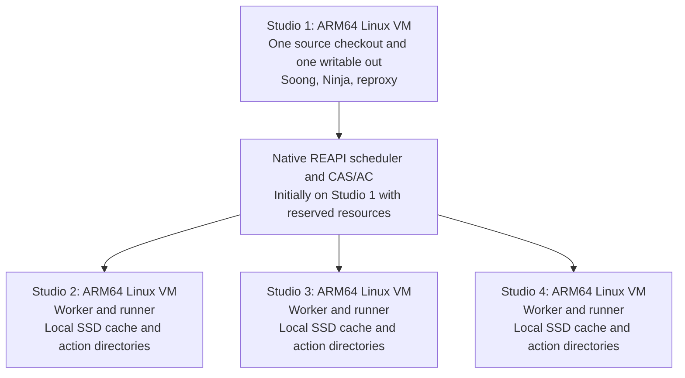

# Android 16 on a four–Mac Studio build cluster

Research date: **27 August 2026, America/New_York**; observations continued on
28 August UTC. Audience: the owner of this Android bring-up workspace.

This is a feasibility investigation, not a cluster installation or a completed
Android port. The primary baseline is **AOSP `android-16.0.0_r4`**, with r1,
public `main`, Android 17 r1, and newer public toolchain mirrors inspected
separately. The existing Evolution X checkout supplies additional, explicitly
labeled execution evidence. No phone was accessed or changed.

## 1. Executive answer

**Recommendation D: keep Android 16's existing x86 host configuration initially,
use native ARM64 Linux VMs and REAPI infrastructure, and test a separate native
Clang execution package for selected remote C/C++ actions.** First establish
remote execution with the known x86 tools under Rosetta. Do not begin by
porting every Soong host variant, JVM dependency, Rust proc macro and ART tool.
This recommendation is an engineering inference, with acceptance tests below;
the four-machine configuration has not been demonstrated here.

The requested fully native Android 16 host is **possible in principle, but a
large integration project rather than a small backport from a known-working
public `main`**. Android 16 already contains ARM64 Soong detection, native
bootstrap selection, musl host variants and real ARM64 build-tool binaries.
The release is missing a complete, selected native compiler/runtime toolchain,
and Make still assumes x86. The pivotal Soong change landed on 27 February
2025, before Android 16. Its upstream test built a restricted tool set, not a
whole Android image. [Soong introduction][soong-arm-intro],
[restricted build-tools recipe][build-tools-script]

This investigation actually built **unmodified Android 16 r4 `soong_ui`,
`mk2rbc`, `rbcrun` and `release-config` as AArch64 ELF executables**, then ran
the `OUT_DIR` query. Supplying the matching ARM64 Go release and its installed
standard-library archives was sufficient. The next real failure was Make's
unset `HOST_ARCH`. Two small experimental Make changes got a product-variable
query past that failure, but left missing native JDK, Clang and Rust paths.
This establishes an inexpensive bootstrap, not an inexpensive complete port.
[Recorded experiments](../research/arm64-cluster/probe-results.json)

**Distributing one build is feasible independently of that port.** Android 16
has substantial RBE wiring, and Buildfarm publishes AOSP/reclient connection
instructions. Neither REAPI nor the scheduler requires x86 CPUs. However,
workers must execute the binaries in each action: uploading an x86 Clang does
not make it native on an ARM64 worker. Soong also supplies Google-specific
image/pool defaults that need deliberate adaptation. [RBE construction][remoteexec],
[Buildfarm AOSP integration][buildfarm-aosp]

Rosetta is a **useful, demonstrated bootstrap and fallback here**, not evidence
of production readiness. A native Ninja successfully ran pinned x86 Clang,
LLD and JDK tools, produced an Android ARM64 object and an x86 executable, and
ran the executable and JVM. Existing workspace records go further, through
real Android module builds and sandbox tests. No complete stock AOSP image,
four-Mac RBE action, sustained performance result, or reproducibility comparison
was established. [New probe record](../research/arm64-cluster/probe-results.json),
[earlier module and sandbox evidence](apple-container.md)

**Go for bounded experiments; no-go for committing a production release
schedule to a fully native Android 16 Mac cluster today.** If the requirement
is a supported, predictable build host immediately, use x86-64 Linux hardware
or cloud workers. AOSP's published host requirements still specify x86-64
Linux. [AOSP requirements][requirements]

## 2. Confirmed facts, hypotheses and evidence limits

| Finding | Evidence class | What it does not establish |
| --- | --- | --- |
| Android 16 selects Linux ARM64 in Soong and its bootstrap shell | Pinned source and upstream history | Complete host support or presence of the selected Go package |
| Native r4 bootstrap produces five AArch64 executables including microfactory | Executed locally; hashes and ELF machine fields recorded | Full Soong graph generation, Kati product correctness, or an image build |
| Native Kati reaches an unset `HOST_ARCH` error | Executed against stock r4 Make | That changing this variable completes the port |
| After an ARM64 host check, Make still selects `linux-x86` outputs | Executed product-variable query | That output-path disagreements elsewhere are resolved |
| Native Ninja, Python and Toybox execute from Android 16 build-tools | Executed locally; 33 bin entries have AArch64 ELF headers, including aliases | Every tool's full functionality or every host library |
| Modern public LLVM mirrors contain ARM64 Clang | Commit/tree inspection and ELF-prefix inspection | Compatibility with Android 16's effective Clang revision |
| ARM64 Rust compiler build support exists in a newer toolchain mirror | Source and history | A publicly populated matching native compiler package or a working Ubuntu recipe |
| Self-hosted AOSP RBE is supported by public client/backend mechanisms | Soong/reclient source and Buildfarm's AOSP guide | This project's ARM64 workers, sandbox or complete build has passed |
| Native compiler execution with an x86 Android host profile is plausible | Explicit target flags plus reclient execution-wrapper design | Compiler equivalence, correct input scanning, or a measured speedup |
| Four Studios will improve build time by a particular percentage | **Unknown** | No full-build timing, hardware inventory for all four machines, or network benchmark was collected |

The original Android checkout was not patched. Native experiments used a new
directory on the existing owning VM's ext4 volume, with separately fetched,
pinned stock Soong and Make repositories. Bootstrap dependencies were checked
against r4 commits. Later configuration queries borrowed support paths from
the existing Android 16 checkout through symlinks; those queries are therefore
**not a complete stock-tree validation**. Fixture omissions such as `pogreb`,
VNDK inputs and PGO profiles are recorded separately from ARM64 failures.
Inspected original dependency repositories remained clean.

The public reference inventory has **81 resolved or explicitly unavailable
ref lookups**, with immutable URLs, full hashes and dates. An unavailable tag
is not proof a repository never had another branch. That distinction mattered:
the ARM64 Clang repository's public `main` is empty, but its toolchain mirror
contains real packages. [Source pins](../research/arm64-cluster/source-pins.json)

The [claims and sources ledger](../research/arm64-cluster/claims-and-sources.json)
maps the decision claims to primary references and recorded probes, and lists
the eight remaining validation gaps separately from confirmed findings.

Research used bounded Gitiles file/tree/commit reads, public branch queries,
targeted history searches, backend source inspection and local probes. Some
Gitiles log endpoints returned 401; visible public commit objects and other
public history views supplied the necessary provenance. No inaccessible
internal Google source or build artifacts are treated as verified. Research
stopped after the major decision claims had primary evidence or an explicit
test obligation; this is not an exhaustive audit of every product-specific
executable in the full Android manifest.

## 3. Android 16 host support and blocker list

### Architecture detection is already partly implemented

In r1 and r4, `build/soong/scripts/microfactory.bash` maps native
`uname -m=aarch64` to `prebuilts/go/linux-arm64`. It overwrites an ordinary
caller-supplied `GOROOT`; merely exporting a system Go location does not
redirect that path. Blueprint builds microfactory and the Go build programs
from source. Its compiler-tool directory follows the executing Go program's
architecture. [Bootstrap selector][microfactory], [Blueprint][blueprint-mf]

`build/soong/android/arch.go` accepts `runtime.GOARCH == "arm64"` on Linux and
forces `BuildOS=LinuxMusl`. Linux glibc host variants remain x86/x86_64;
LinuxMusl includes ARM and ARM64. The ARM64 musl C/C++ implementation is in
`cc/config/arm_linux_host.go`; the similarly named `arm64_linux_host.go`
contains a different LinuxBionic path. Both Soong configuration layers select
`linux-arm64` for native host prebuilts. These are selected code paths, not
conclusions drawn from directory names. [Architecture selection][arch],
[ARM musl toolchains][arm-musl], [UI host paths][ui-config]

The actual remaining Make failure is more specific than an immediate
"unsupported aarch64" message. `core/config.mk` obtains `uname -sm`;
`core/envsetup.mk:175` initializes `HOST_ARCH` only for x86_64. In r4,
`.KATI_READONLY` then encounters the undefined variable at line 195, before
the later explicit unknown-host error. Its independent
`HOST_PREBUILT_ARCH := x86` assignment at line 248 is another defect.
[Make host configuration][make-env]

Even after those two changes, `core/clang/config.mk:3` selects the executable
`LLVM_READOBJ` under `$(BUILD_OS)-x86`. It needs separate routing or translation.
The adjacent `LLVM_RTLIB_PATH` also mentions linux-x86, but points to target
runtime data; that spelling alone is not a host-execution blocker.
[Make LLVM selection][make-clang]

### Selected tools and their status

| Tool family | Android 16 r4 selection / observed contents | ARM64 assessment and required action |
| --- | --- | --- |
| Go | Bootstrap selects `prebuilts/go/linux-arm64`; manifest supplies only the x86 Linux Go repository. r4 uses Go **1.24.1**; r1/main use **1.23.4**. | Missing selected distribution. Matching upstream ARM64 Go plus installed stdlib archives worked for the r4 bootstrap. Do not use a random current Go release. |
| microfactory, Soong UI, mk2rbc, rbcrun, release-config | Built from Go source during bootstrap | **Native compilation verified** for all five; the successful query executes microfactory/Soong UI, not necessarily every helper. `runtime.GOARCH` follows the compiled executable, not a runtime environment override. |
| Ninja, Kati, Toybox and bootstrap tools | `prebuilts/build-tools/linux-arm64/bin` and `path/linux-arm64` | Actual AArch64 binaries. Native Ninja/Python/Toybox smoke tests passed; native Kati ran the product queries. Keep matching libraries and path symlinks. |
| Python | ARM64 `py3-cmd`/launcher variants and common stdlib in build-tools; observed Python **3.13.1** | Available. Python extension modules and launcher/stdlib/header versions must remain compatible. Replacing this with Ubuntu's Python 3.12 is not an equivalent whole-build fix. |
| C/C++ compiler and LLD | Soong selects `prebuilts/clang/host/linux-arm64/<effective-version>`; r4 default is **clang-r563880c / LLVM 21** | Matching native package absent from stock manifest. Modern mirrors offer LLVM 22/23 packages, not a demonstrated r4 replacement. Rebuild the exact effective compiler or use Rosetta initially. |
| LLVM utilities and implementation libraries | `llvm-ar`, objcopy/objdump/readobj, symbolizer, `libclang`, `libLLVM`, runtime libraries and helper modules | Must audit executable selection and in-process libraries separately. New mirror changes connect native utility filegroups, but their newer helper/property APIs need a manual r4 adaptation. |
| Java | UI selects `prebuilts/jdk/jdk21/linux-arm64`; JDK21 repository has Linux x86 and Darwin ARM64, **not Linux ARM64** | Missing selected package. `OVERRIDE_ANDROID_JAVA_HOME` can test a matching ARM64 JDK, but BP modules and JNI dependencies also need review. Native Darwin binaries cannot run in Linux. |
| Rust compiler / host stdlib | r4 default **1.88.0**; native selection lacks a distribution. `UseHostMusl()` instead selects literal `linux-musl-x86`. | Major closure gap. A native Rust compiler, matching host std/proc macros and correct Soong/prebuilt selection must agree. Modern Rust builder support does not supply these r4 artifacts. |
| Bindgen | Rust bindgen selection retains an x86 libclang path for musl | An ARM64 process cannot load x86 `libclang.so`. Preserve an x86 bindgen/libclang pair or rebuild the pair for ARM64 and the correct libc. |
| Protobuf | Bootstrap's Go protobuf dependency is source; C++ generator `aprotoc` is a built host tool; ARM64 build-tools includes `libprotobuf-cpp-full.so` | Not a reason to wholesale upgrade protobuf. Rebuild the generator/runtime at the branch's versions and preserve generated-code compatibility. |
| RBE client | Selected `remoteexecution-client/live` bootstrap, reproxy and rewrapper are x86-64 ELF; scanner is also x86-64 | Rosetta fallback is credible. A native client/scanner distribution is a separate port; public Linux ARM64 CIPD packages were not found. |
| clang-tools | r4 repository contains Linux x86 header/ABI tools | Rebuild matching host tools and their LLVM dependencies, or keep a consistent translated process group. ABI-check tools are build-critical for some modules. |
| misc / development prebuilts | Many tools are under Linux x86 paths; others are JARs, source or target data | Product/action-dependent audit required. Yasm, dtc/libufdt and older SDK helpers must not be assumed portable from a directory rename. |
| Bazel / Kleaf | r4 manifest retains Bazel common protobuf inputs but not the old Linux Bazel executable project | Bazel is not needed to make the demonstrated Soong bootstrap native. Reclient builds, kernel/Kleaf or particular products can introduce a separate native Bazel/JDK/toolchain requirement. |

Sources: [r4 manifest][manifest-r4], [build-tools definitions][build-tools-bp],
[Go version][go-version], [Clang selection][cc-global], [JDK definitions][jdk-bp],
[Rust selection][rust-global], [Rust prebuilt variants][rust-prebuilts],
[bindgen selection][bindgen], [protobuf generator selection][proto],
[reclient pinned binaries][reclient-bin],
[native tool execution record](../research/arm64-cluster/probe-results.json).

The native build-tools set includes aconfig, acp, aidl, bison, bloaty, brotli,
bzip2, ckati, create_minidebuginfo, edit_monitor, flex, bc, hidl-gen/hidl-lint,
m4, make, n2, ninja, nsjail, awk, openssl, Python launchers, rkati,
tool_event_logger, toybox, xz and ZIP utilities. This inventory is not a claim
that all have been functionally tested. `ckati --version` rejects that flag;
its later execution of real Make queries is the relevant usability evidence.

### Host variants, output paths and in-process ABI boundaries

There are three independently selected output paths to reconcile. ARM64
Soong forces LinuxMusl, but `UseHostMusl()` only reflects the product variable.
Without that variable, the source predicts Soong install paths under
`out/host/linux_musl-arm64`; UI expects `out/host/linux-arm64`; Make initially
selects `out/host/linux-x86`. The last mismatch was reproduced. Setting
`USE_HOST_MUSL=true` addresses the Soong naming branch but also selects the
x86 musl Rust compiler. It is not a complete solution.
[Install paths][install-paths], [UseHostMusl][android-config], [Rust selector][rust-global]

Rosetta can translate a child process. It cannot make an x86 rustc load an
ARM64 proc-macro `.so`, an ARM64 bindgen load x86 libclang, or a native JVM
load x86 JNI. Nor can it make glibc and musl libraries interchangeable inside
one process. The older Rust compiler-selection commit explicitly documents
the proc-macro libc dependency. [Rust musl rationale][rust-musl-intro]

### Source-built image and Android utilities

The inspected definitions for `e2fsdroid`, `mke2fs`, `mkfs.erofs`, `liblp`,
`lpmake`, `checkpolicy`, `secilc` and their principal libraries enable host
source builds without an explicit x86-only gate. `lpmake` lives in
`system/extras/partition_tools`, while `liblp` lives in `system/core/fs_mgr`.
These are plausible native rebuilds, not unavailable proprietary prebuilts.
Their dependency graphs and generated image/policy correctness still require
testing. [e2fsprogs][e2fs], [EROFS][erofs], [liblp][liblp], [lpmake][lpmake],
[SELinux compiler][secilc]

`mkbootimg` is a Python host module with an `avbtool` dependency; repacking
adds lz4, mkbootfs and Toybox. Native Python alone does not complete that chain.
ADB/fastboot do not generate filesystem images, but stock r4's
`build/target/product/base_system.mk` already includes both in
`PRODUCT_HOST_PACKAGES`. Their source-built host dependency closure therefore
belongs in normal platform/droid validation, not just a later SDK exercise.
They were not run against a device in this investigation. [Boot tools][mkbootimg],
[default host packages][base-system]

**ART/dexpreopt deserves its own gate.** `dex2oat` has a 64-bit host source
variant, and ART has ARM64 assembly/runtime implementations. That is stronger
than a directory name but weaker than native-host validation: signals,
unwinding, code generation, constrained low-address mappings and boot-image
generation need actual tests. Its low-4GB allocator is enabled on 64-bit
Linux. Determine whether the selected product uses source-built or prebuilt
ART tools. [dex2oat][dex2oat], [ART runtime][art-runtime],
[ART mappings][art-mmap]

Vendor/kernel/product-specific host binaries remain an open inventory item.
Qualcomm/Xiaomi helpers, kernel build tools, AVB signing plugins or proprietary
generators can add executables that a generic GSI build does not exercise.
Nothing here establishes Nezha compatibility or permits replacing device
firmware, partition metadata or security policy to make a host build pass.

## 4. Android 16 versus public main and newer mirrors

The premise that current public `main` is a newer, fully working ARM64 AOSP
host needs correction. At inspection time, Soong `main` still points to
26 March 2025, while Android 16 r4 contains later changes. The live
`android16-qpr2-release` Soong and Make heads match the r4 pins below. No
newer `mirror-goog*` platform Soong branch was exposed; Make's only such branch
was an old emulator branch. Toolchain mirrors are different and do contain
2026 native-host development.

| Repository | Android 16 r4 | Public `main` | Relevant difference |
| --- | --- | --- | --- |
| `platform/build/soong` | `f389fa2a2a768a93bc99957e2288f3fbee032bff` | `d046c2afef086a35d24222b09f4d2c4914e8a2a5` | Both have native ARM64 bootstrap selection; main is older |
| `platform/build` | `b815dded1eafbf06191a6ae306956bb6ed6fb415` | `045a3d6a3e359633a14853a5a5e1e4f2a11cbdae` | Both retain Make's x86 assumptions |
| `platform/build/blueprint` | `c39c8a4c103f1393f015a5befa7726f0c14c9bc2` | `dc14b923a2526131c8ffedf3f7ce7a17e9e69a99` | Bootstrap source is portable; r1 and main have the same whole tree |
| `platform/prebuilts/build-tools` | `412724a805835d89234d67c363f7ada7f5f8a67f` | `07d9f1ce91469a888dd091aac1589f7e2b2f8d90` | Both already contain selected ARM64 tools |
| `platform/prebuilts/go/linux-x86` | `71c50d4d0da8b3dee5c70ee45789d001674ca5f6` | `166b4d06e301e8baf20303835e6528bb5dc55c31` | Go 1.24.1 versus 1.23.4; ARM64 sibling main is empty |
| `platform/prebuilts/jdk/jdk21` | `ef5bcc92586b839ae3dbacc154127092fa4002ec` | same | No Linux ARM64 directory in either |
| `platform/prebuilts/rust` | `06a4f29f8512c6b77bdce81dd036a3e39954803b` | `b9c747ff3d3c30c2014b6f94f8599415010ac37f` | No native Linux ARM64 compiler package |
| `platform/prebuilts/clang/host/linux-x86` | `9916fb51ccb914d62d35ad9a7b9b21d2ef046928` | `70a12c4fe88940ab2b0e6d763492dffa2f07e15a` | Neither supplies an execution-native ARM64 r4 compiler |

All table entries link to their immutable repository URLs and dated metadata
in [source-pins.json](../research/arm64-cluster/source-pins.json). The r1
Soong pin is `533c3c2c9166b49caa556518bb547d8f9acf9594`.

Newer public mirrors change part of the assessment:

| Newer public source | Verified state | Android 16 consequence |
| --- | --- | --- |
| ARM64 Clang mirror `3d378df8ab6cfad44289f8af137a30c6eba684b8` | Contains r584948b / LLVM 22.0.1, r596125 and r614150 / LLVM 23.0.1; inspected Clang and library prefixes are AArch64 ELF | A real compiler is available for experiments, but none of those versions equals r4's default r563880c |
| LLVM builder mirror `efd615285cdaf2b3417f7a6e272134dcb869fad8` | Native Linux ARM64 musl builder and CI/publication support | Useful architecture/path changes for rebuilding the older compiler; do not adopt all current defaults |
| Rust builder mirror `24664bdd11e9f1deb9fb3434c7489a4cc4e4eaec` | Native ARM64 musl compiler target and updater | Native compiler source support exists; stage-0/runtime/toolchain integration remains |
| Rust ARM64 prebuilt repository `5bf291b6aaecfab10b2012dc6cbd7316578d321c` | Empty public main; no populated mirror ref found | Not a ready distribution to copy |
| JDK21 mirror `fab99e00da31aa450047279ee6c1671a21a1bc48` | Updated metadata/input lists, still no Linux ARM64 package | Does not close Java selection |

[Native Clang mirror][native-clang], [LLVM builder][llvm-builder],
[Rust builder][rust-builder], [Rust ARM64 root][rust-arm-empty]

Android 17's inspected release also retains the central Make issue. Its Rust
packages moved into separate `prebuilts/rust-toolchain/*` repositories; an
emptied old `prebuilts/rust` directory is a migration, not proof Rust vanished.
Importing modern manifests or BP definitions wholesale would introduce that
layout change, newer compiler defaults and other unrelated infrastructure.

**When did native ARM64 Linux-host support become functional?** The evidence
supports a date for native Soong/tool bootstrapping and later dates for native
compiler construction. It does **not** support a date when a complete public
AOSP platform manifest first became a working native ARM64 build. Claiming
such a date from these commits would exceed their test scope.

## 5. Exact relevant upstream commits

Dates in this table are committer calendar dates as recorded upstream. The
companion ledger includes full author/committer timestamps, changed paths and
reported tests for all 27 inspected changes. A commit's own `Test:` line is
an upstream report, not a test repeated in this investigation.
[Commit ledger](../research/arm64-cluster/upstream-commits.json)

| Repository | Commit | Date | Change and relevance |
| --- | --- | --- | --- |
| build/soong | [a9b2aacf07697e9fa00daf2c6fc76a73392563b7][musl-variants-intro] | 2022-06-24 | ARM/ARM64 LinuxMusl host variants and C/C++ toolchains; originally useful for cross-building sysroots |
| external/musl | [a7a2ff059d43b2571a5153c312070ab059886231][musl-source-intro] | 2022-06-24 | ARM architecture-specific musl build flags |
| build/soong | [1faf82305a5dae78c00cf71156284f39e5bd53a6][rust-target-intro] | 2022-06-28 | ARM/ARM64 musl Rust target definitions; cross-host test, not a native compiler distribution |
| build/soong | [9a027be6bc304f5fdfaea3fe46f4c2315e031b8b][hide-cross-musl] | 2022-06-28 | Hide cross-host musl modules from Make, which does not understand them |
| build/soong | [567d342ed830d043602bd0ce7805a6adc69e4612][rust-musl-intro] | 2022-07-01 | Match rustc's libc to musl proc macros; x86 compiler-path consequence persists |
| build/soong | [c0f0eb86db82f399618569322cdd36af45472abf][hostcross-intro] | 2022-08-22 | Separate Host and HostCross variant selection |
| external/musl | [ad6291667ccf603d9629378bbdadf0a58711b211][musl-loader-intro] | 2022-08-25 | ARM-capable relative-loader trampoline, runtime page size and syscall fixes |
| build/soong | [390fc746d0eab743c18033d9e851f5b4ec435a3d][musl-sanitizer] | 2023-05-17 | Disable sanitizer combinations lacking musl ARM64 runtimes; not all host sanitizer combinations are available |
| toolchain/llvm_android | [ead88453249a95fb3f8a4edb49abe06267a4a43c][llvm-old-attempt] | 2023-08-02 | Earlier experimental non-x86 LLVM build support |
| toolchain/llvm_android | [52000803d21413dbfa8332b9462c3bb0f945a0d7][llvm-old-revert] | 2023-08-10 | Reverts that attempt because Mac and PGO/BOLT builds broke; do not count it as retained support |
| build/soong | [f7a1f6418ce3fa6b5685ab97cf76d5f9c94e5c14][go-hostcross] | 2024-10-28 | Go HostCross variants; explicitly does not make Go outputs cross-compiled |
| build/soong | [92ac46d1fe04a94d94025554bcecc5f8cb2416ae][soong-arm-intro] | 2025-02-27 | `runtime.GOARCH` ARM64 handling, musl selection, native Go/prebuilt/PATH selectors |
| build/soong | [433dcb4e7f8a93c93dd20361c55056a24e4f786e][soong-arm-merge] | 2025-02-27 | Merge of that native-bootstrap change into public main |
| prebuilts/build-tools | [14fe58ad6208eb5f863057b99aa45d907e6c8f52][tools-rename] | 2025-02-27 | Rename `linux_musl-arm64` to `linux-arm64`; retains musl as the intended Linux ARM libc |
| prebuilts/build-tools | [a5112403ac2eb2b56d00581167411e49af2f8390][tools-path] | 2025-02-27 | Add actual `path/linux-arm64` tool symlinks |
| prebuilts/build-tools | [762a7b15cdb657ab2f8d1106ed3f72c73ef12986][tools-go] | 2025-02-27 | Native Go-tool build recipe and ARM64 bootstrap-Go packaging |
| prebuilts/build-tools | [aba3dea311239df3acc191434d965ca1f93eed0f][python-headers] | 2025-03-12 | Package Python headers for extensions; does not make arbitrary Python/JNI libraries portable |
| toolchain/llvm_android | [3a4d8082d113b80076d2f3ca8fcdcde1d166b015][llvm-native-intro] | 2026-01-12 | Retained native Linux ARM64 musl Clang builder; initial local build, CI bootstrap prerequisites still listed |
| toolchain/llvm_android | [63b7ae2df512c3a09370718fa7c7f6c4820fa62e][llvm-native-ci] | 2026-01-15 | Add `llvm_linux_arm64` CI target |
| prebuilts/clang/host/linux-arm64 | [198cef08637a6133e98b4a80e36f0ca35775fa9a][clang-bootstrap] | 2026-01-20 | Populate bootstrap native Clang package on the mirror lineage |
| toolchain/android_rust | [aec25ae692eef715842a81c438fa36c1ae648c53][rust-native-intro] | 2026-02-13 | Native ARM64 musl compiler construction; upstream validation says manual |
| toolchain/llvm_android | [39d0e3ef225b914f11a46e7906c0de8ba234c563][llvm-native-publish] | 2026-02-17 | ARM64 Clang package publication/update support |
| toolchain/android_rust | [d2909511721d4ff2a75567f897d482e8b0873ba5][rust-native-fetch] | 2026-02-27 | Fetch ARM64 Rust build artifacts; not proof those artifacts are publicly available |
| prebuilts/clang/host/linux-arm64 | [a70cecf3ce95d669302703e43c38c823af3f8513][clang-update-apr] | 2026-04-15 | Add a newer native Clang r596125 package |
| prebuilts/clang/host/linux-x86 | [cd16b93a2ae9bec89a83d63f72d49edd751a8381][llvm-utility-routing] | 2026-06-22 | Connect LLVM build-tool modules to native ARM64 filegroups and musl dependency |
| toolchain/llvm_android | [af9e9f01630d3db6dbd933ea5b11c937fb0c5d11][llvm-native-pgo] | 2026-07-09 | ARM64 PGO; optional performance work, not the minimum bring-up dependency |
| prebuilts/clang/host/linux-arm64 | [3d378df8ab6cfad44289f8af137a30c6eba684b8][native-clang] | 2026-08-25 | Current inspected native package update, r614150 / LLVM 23.0.1 |

For Java, ADB/fastboot, protobuf and filesystem utilities, no single missing
"ARM64 host enablement" cherry-pick was identified that closes Android 16.
The evidence instead distinguishes missing prebuilt distributions from
already host-enabled source definitions. Ninja/Kati/Python availability comes
through the build-tools history above. A native reclient/scanner is a separate
public-source build task; its r4 binary release suffix could not be mapped to
an accessible public GitHub source commit, so no such mapping is invented.

## 6. Minimum viable native-host work, without wholesale merging

```text
Android 16 ARM64 Soong selectors (already present)
  └─ matching ARM64 Go + installed stdlib archives
       └─ native microfactory / Soong UI / helper binaries [demonstrated]
            └─ existing ARM64 build-tools and complete sibling libraries
                 └─ Make HOST_ARCH + HOST_PREBUILT_TAG + consistent output paths
                      ├─ coherent HostMusl policy and host variants
                      ├─ exact-version native Clang execution + native libraries
                      │    ├─ LLVM utility routing and matching target runtime data
                      │    └─ source-built host C/C++ utilities and ART validation
                      ├─ native JDK21 + matching JNI / Java-tool selection
                      ├─ native Android-version Rust + musl std / proc macros
                      │    └─ matching native bindgen + libclang
                      └─ product/kernel/vendor executable audit
                           └─ local complete-image correctness gate
                                └─ reclient/scanner + honest REAPI platform
                                     └─ remote-action and full-build gates
```

| Change | Smallest defensible treatment | Compatibility concern |
| --- | --- | --- |
| Soong ARM64 detection / musl target registrations | **No cherry-pick:** already in r1/r4 | Reapplying or wholesale merging main adds no missing distribution |
| Go installation | Matching upstream release for a probe; reproduce branch build recipe for a maintained prebuilt | Blueprint requires installed stdlib archives; preserve Go compiler/library version agreement |
| Ninja/Kati/Python/bootstrap tools | Use the existing r4 ARM64 binaries with their complete libraries, common payloads and path links | Distro Ninja/Kati/Python may lack Android flags, patched semantics or extension ABI |
| Make architecture and tag | **Manual small backport/patch**; the actual eight-line probe is included separately | This does not fix all hardcoded paths or make a whole platform build valid |
| Soong/UI/Make output and musl consistency | **Manual integration**, verified by emitted variables and Ninja commands | Avoid `linux_musl-arm64` / `linux-arm64` / `linux-x86` disagreement |
| Clang/LLD | **Rebuild Android 16's effective revision** using selected architecture/path ideas from `3a4d808…`; use Rosetta until validated | Exact Android patches, resource headers, compiler-rt, libc++, target sysroots, LTO and Rust LLVM compatibility |
| Modern native Clang package | **Copy only into an isolated experiment**, not as a drop-in production prebuilt | LLVM 22/23 is not LLVM 21; even a major-version match would not establish equivalence |
| LLVM utility BP routing | **Manual backport** of the intent of `cd16b93…` and required filegroup helpers | Newer helper functions and `Host_linux_arm64` property wiring are not assumed available unchanged in r4 |
| Rust compiler and host libraries | **Rebuild from branch-matched source**, adapting the bounded `aec25ae…` architecture/linker/package changes | Stage-0 dependency, rustc/std version locking, musl ABI and proc macros; current builder has Alpine-specific library search paths |
| JDK21 | Matching native OpenJDK build; distro JDK only for a bounded diagnostic through `OVERRIDE_ANDROID_JAVA_HOME` | Javac/jlink/module layout, Java language level, generated bytecode and JNI; other hardcoded BP paths remain |
| Python/protobuf/source utilities | Prefer branch source or existing native package, **not a global version upgrade** | Python extension ABI, generated protobuf/runtime agreement, image and policy output semantics |
| RBE Go programs / C++ scanner | Rebuild and validate separately, or **Rosetta fallback** initially | Native Go alone does not provide the LLVM scanner; reclient/Bazel build tooling also has x86 assumptions |
| Misc/vendor helpers | Classify each executed binary: source rebuild, matched prebuilt, or per-process Rosetta fallback | ELF32, proprietary distribution rights and in-process plugins can be hard blockers |

The full-native classification is **Large**, not Extremely invasive by default:
the central Soong architecture machinery exists and several packages are
already native. The size comes from completing and testing multiple compiler,
runtime and product dependency chains. The native Rust builder's current
ARM64 musl flags still reference `/usr/lib/gcc/aarch64-alpine-linux-musl/15.2.0/`;
it is not automatically a hermetic Ubuntu recipe. [Rust builder configuration][rust-builder-config]

The [experimental Make patch](../research/arm64-cluster/probe-host-detection.patch)
is evidence of two tested changes, **not a supported host patch set**. It was
applied only in the isolated probe tree. It must not be mistaken for a ready
patch to apply to the active Evolution X checkout.

## 7. Rosetta for Linux

Apple's Linux translation supports x86-64 ELF user programs inside an ARM64
Linux VM. It does not emulate an x86 kernel or require a full x86 VM. Dynamic
executables still need their x86 interpreter and libraries, commonly
`/lib64/ld-linux-x86-64.so.2` and amd64 glibc. Native ARM64 libraries do not
satisfy those dependencies. AOSP's relative musl loader can also hide dynamic
runtime work behind an executable with no `PT_INTERP`; absence of that header
alone is not proof of a self-contained static tool.
[Apple Linux translation][apple-rosetta], [musl loader history][musl-loader-intro]

| Concern | Assessment |
| --- | --- |
| ELF and dynamic linking | Useful for the inspected ELF64 x86 tools. Retain interpreter, RPATH-relative libraries and required GLIBC symbol versions. Audit executed ELF32 separately; the documented translation path is x86-64. |
| `uname` and shell scripts | Native Toybox reports `aarch64`; translated x86 Toybox reports `x86_64` in this VM. A command-scoped x86 PATH can preserve the existing x86 build profile without replacing the system uname. It does not make the CPU x86. |
| `runtime.GOARCH` | Compile-time property of the executable. An x86 Soong remains `amd64` under translation; native Soong is `arm64`. `GOARCH=arm64` in a runtime environment does not change an existing binary. |
| Go / process spawning | Both native bootstrap and translated tool spawning have direct local evidence. Large fan-out, scanner load and limits still require sustained tests. |
| JVM / JIT | Pinned translated javac and Java ran. Native JVM substitution needs matching JNI. Historical JVM translation regressions warrant version pinning and stress tests, not a claim that current Java cannot work. |
| Clang and LLD | Pinned translated compiler/linker executed; output ISA is independent of execution ISA. Full LTO and large links were not stress-tested here. |
| mmap / RAM | Native ART's low-address mappings, large JVM heaps, mmap-heavy linkers, page faults and OOM behavior need tests. No universal memory incompatibility was demonstrated. |
| Namespaces / sandbox | Real Linux namespaces exist in the VM. Earlier workspace tests exercised nsjail, source-write rejection and network isolation; the worker's actual sandbox still needs its own test. |
| seccomp | Syscall architecture and translation matter. Do not assume an x86 filter works unchanged, and do not disable filters to pass the build. |
| Interpreter visibility in a jail | Linux binfmt's `F` facility is relevant to crossing mount namespaces. Verify the actual registration/translator/runtime visibility; a missing file at a guessed `/proc` name is not proof translation is disabled. |
| File descriptors / processes | Current guest reports 1,048,576 open-file and 514,924 process soft limits; Soong RBE checks for at least 16,000 and 2,500 respectively. Backend/container/systemd limits may differ. |
| Debugging | Do not assume normal x86 ptrace/GDB behavior through translation. Preserve native core dumps, JVM error files and translator diagnostics as available. |
| Performance | AOT caching and memory-ordering support exist, but installed-kernel support and AOSP performance were not benchmarked. No percentage penalty is justified from these probes. |

[Go runtime architecture][go-runtime], [kernel binfmt][binfmt],
[kernel seccomp][seccomp], [Soong RBE limits][rbe-ui],
[Apple translation performance][apple-tso], [OrbStack debugging limitations][orb-debug]

The earlier Rosetta/macOS-app retirement discussion must not be applied
blindly to Linux: current Apple documentation says macOS 27 integrates Intel
Linux translation directly, without a separate Rosetta installation. This is
the documented current behavior, not an indefinite future support promise.
The tested Mac runs macOS 27.0 build 26A5421a, so that OS build should remain
part of the evidence and any regression comparison. [Apple current lifecycle][apple-lifecycle]

**Verdict:** useful bootstrap mechanism; credible experimental build fallback;
production acceptance is unproven. Running the whole x86 host profile under
Rosetta is initially simpler because generated host executables and their
in-process libraries remain consistent. A native-Soong hybrid is possible,
but it exposes ARM64 host variants and all of their missing dependencies.
Those two hybrids should not be conflated.

## 8. Android 16 RBE and the smaller compiler-execution design

One Ninja remains responsible for the dependency graph and `out/`. Its wrapped
actions go through `rewrapper` to a local `reproxy`, then to a REAPI execution
service. CAS transports declared input trees and outputs. Reproxy startup is
Linux-gated, but that gate has no GOARCH restriction. Separate bootstrap and
toolchain constraints still apply. [Proxy startup][rbe-ui], [Soong UI][ui-config]

For the initial RBE experiment, keep `out/` inside the source execution root.
The inspected client rejects relative input/output paths escaping that root;
the external output directories used for local bootstrap probes are not a
validated RBE layout. [Path translation][reclient-paths]

### What can actually run remotely

| Action class in r4 | Actual wiring | Default strategy when wrapped |
| --- | --- | --- |
| Ordinary C/C++ compilation | Make adds rewrapper to CC_WRAPPER/CXX_WRAPPER; Soong consumes it | **local** unless `RBE_CXX_EXEC_STRATEGY` is set |
| C/C++ linking / partial linking | `RBE_CXX_LINKS=1` | local |
| Static archives | Ordinary local `ar` rules | Local, not automatically remote |
| javac | `RBE_JAVAC=1`, including inspected r4 incremental variants | remote_local_fallback |
| Turbine Java headers | `RBE_TURBINE=1` | local |
| D8 / R8 | `RBE_D8=1` / `RBE_R8=1`; actual remote rule selection exists | remote_local_fallback |
| Rust | `RBE_RUST=1` with declared source/dependency inputs | local |
| clang-tidy / ABI dumper / ABI linker | Their `RBE_*` gates | local |
| Metalava / lint | Explicit RuleBuilder rewrapper paths | local |
| Selected JAR/ZIP and signapk operations | Their individual gates | local; keep remote signing disabled initially |
| Kotlin / KAPT | No RBE call-site wiring in inspected r4 rules | Local |
| AIDL / AAPT2 resource compilation/linking | No general remote wiring in inspected rules | Local |
| Generic genrules | Sandboxing does not automatically mean remote execution | Local unless explicitly adapted |
| Soong graph, Make/Kati, image generation and general packaging | No general remote implementation | Coordinator work |

[Make wrappers and defaults][make-rbe], [C/C++ rules][cc-builder],
[Java rules][java-builder], [dex rules][java-dex], [Rust rules][rust-builder-r4],
[Kotlin rules][kotlin], [RuleBuilder][rule-builder]

`AndroidRemoteStaticRule` is not proof of remoting: it also controls Ninja
pool assignment. Inspect the selected wrapper or explicit `Rewrapper()` call.
Likewise, **`USE_RBE=1` alone is not evidence C++ executes remotely**. Initial
validation must use `exec_strategy=remote`, disable cache acceptance/update for
the test action, and inspect the worker identity. A successful local fallback
or cache hit is not the requested execution proof. [Rule implementation][remote-rule]

### Backend connection and platform matching

`RBE_DIR` selects the client installation; its `bootstrap` starts reproxy.
Rewrapper connects to the proxy's local Unix socket. `RBE_service` selects the
remote gRPC service, `RBE_instance` the instance, and `RBE_cas_service` can
select a separate CAS endpoint. `NOSTART_RBE` permits manual proxy lifecycle
management. `NINJA_REMOTE_NUM_JOBS` controls remote concurrency; it does not
give every local action that parallelism.

The stock command platforms contain a Google `container-image` digest and
`Pool=default` or `Pool=java16`, with **no CPU ISA property**. The image is
inserted in `remoteexec.go`, in the UI's RBE environment construction, and
independently in Make's `core/rbe.mk`. Reclient command-line settings take
precedence over environment/config settings; exporting `RBE_platform` alone
is not a reliable replacement. Adapt those generators or use a deliberately
controlled mapping, and verify the resulting action platform.
[Platform construction][remoteexec], [Make platform][make-rbe], [UI defaults][rbe-ui]

For native compiler actions, use an agreed platform such as
`OSFamily=linux,ISA=arm-a64`, an immutable native runner image, and a declared
pool. These are matched properties, not automatic CPU autodetection. The
REAPI lexicon supplies names, but the client, scheduler and worker configuration
must agree. Do not silently execute different tools under an existing action
identity. [REAPI platform conventions][reapi-platform]

Coordinator and workers do not have to share an ISA. They do need compatible
execution tools and environments for each action. Android's output target
architecture is separate from both. Local input scanning and fallback must
also work; a mixed fleet needs per-action routing rather than an undifferentiated
pool. Workers obtain source inputs from CAS, not a full checkout.
[REAPI action/input model][reapi]

The publicly available client implementation is sufficient to investigate a
self-hosted service. Google-specific auth modes, `stubby` checks, image names,
internal documentation and optional metrics integrations are not a required
private execution engine. The r4 Dockerfile associated with the image defaults
uses an old Ubuntu base; it is not a current secure worker recipe.
Use a maintained, pinned runtime image. [Public reclient][reclient-source],
[published legacy image recipe][reclient-docker]

C/C++ header scanning, response files and toolchain dependency lists make
many cross-compilation actions suitable for remote execution. They do not
make the entire Android tree hermetic. Replacement tools need complete
`remote_toolchain_inputs` or executable-specific companion lists, including
native shared libraries. Shell, environment, interpreter and system-library
dependencies must be provided by the declared runner environment.
[Input discovery][reclient-inputs]

### Recommendation D: keep the host model, change selected execution tools

Android 16 explicitly puts `-target` in C, assembler and linker flags. Thus an
ARM64-native Clang can potentially emit the same x86 host objects or Android
ARM64 objects while the build continues to use `HOST_ARCH=x86_64`.
This avoids requiring native Rust proc macros, native bindgen/JNI, or native
ART merely to measure distributed C++ compilation. [Target flags][cc-target-flags]

```text
x86 Soong / Kati / JDK / Rust host profile, under Rosetta
       │ unchanged Android target and x86 host output flags
       v
x86 reclient + dependency scanner, under Rosetta initially
       │ original compiler command used for input scanning
       v
REAPI action with a hashed, allowlisted execution wrapper
       │ wrapper + matching native compiler package included in CAS
       v
ARM64-native Clang on ARM64 worker
       ├─ Android ARM64 objects
       └─ x86 host objects → host tools still run under Rosetta
```

Reclient has `--remote_wrapper` and `--local_wrapper`. In the inspected public
client source, input processing sees the original command; execution prepends
the wrapper later, and the **remote wrapper** is added to toolchain inputs.
The actual r4 rewrapper's help output was also checked locally and contains
both flags; its dispatch/input behavior still needs the proposed test because
that binary was not mapped to the inspected public source commit. Keep local
fallback/racing disabled until local and remote mappings are equivalent.
This provides a concrete experiment, not a completed compiler substitution.
[Wrapper implementation][reclient-action],
[wrapper inputs][reclient-server]

Preserve the stock x86 scanner/bindgen libraries and Android target runtimes.
Give native Clang its own native implementation libraries and the exact
matching resource headers/runtime data. Check native LLD selection separately;
`-fuse-ld=lld` or existing `-B` options do not prove which linker executes.
Initially exclude plugins, external assemblers and LTO until each is validated.
That exclusion substantially narrows device coverage: r4 normally enables
ThinLTO for 64-bit device modules, while host and LP32 modules default out.
ARM64 links also normally request the release MLGO register-allocation advisor.
ThinLTO/MLGO parity is therefore a required gate before calling this C++ subset
representative. A ThinLTO `.o` may be LLVM bitcode rather than ELF; inspect its
target triple. Do not globally disable these optimizations and call the build
equivalent. Keep the wrapper and native package in the action digest, and
disable cache use during equivalence tests. [LTO defaults and flags][cc-lto]

Do **not** globally replace `LLVM_PREBUILTS_BASE` or the `linux-x86` Clang
directory with an ARM64 package. Those paths also feed x86 libclang consumers,
Rust linking and target runtime data. Soong's current REParams lacks a direct
RemoteWrapper field and Ninja filters environment variables, so integrating
the experiment will require a small explicit wrapper/platform change or a
controlled launcher. It is not promised to work by exporting one variable.

The uncertain component is a faithful native **Android 16-version** execution
package and equivalence with the scanner, not the ability of ARM64 hardware
to compile for x86. No native compiler replay or remote-wrapper action was
executed during this research. If that experiment fails, retain translated
actions or use x86 workers rather than expanding the port without a time limit.

## 9. Self-hosted REAPI backends

These projects can supply execution rather than just a remote cache. Their
current source was inspected; none was deployed in this investigation.

| Backend | Scheduler / CAS / AC / worker organization | ARM64 evidence | Assessment |
| --- | --- | --- | --- |
| **Buildfarm** | Java server and workers with a Redis backplane; execution, storage and action-cache services | At `05f13afb95aee3d5fac2f60f9527f7358315d389` (2026-08-26), OCI definitions target amd64 and arm64 server/worker images, including native sandbox wrappers | Best first AOSP compatibility experiment because the project has an explicit AOSP guide; not proof our native compiler actions work |
| **Buildbarn** | `bb_storage`, `bb_scheduler`, `bb_worker` and separate `bb_runner` | At `13313e6ab05b00769af48cf5d6e4926ce15b1f2b` (2026-08-14), CI defines cross-build/upload targets for Linux ARM64; no native ARM64 CI execution was verified | Strong alternative with explicit platforms and local caches; worker/runner isolation needs deliberate deployment |
| **BuildGrid + BuildBox** | REAPI server and scheduler, configured storage, C++ workers and `buildbox-casd` | Current source maintained; native deployment not tested here | Feasible alternative; local CAS and a sandboxed runner are important, not optional performance afterthoughts |
| **NativeLink** | Rust server can provide cache, scheduler and worker roles | `1330267e5a5ef8fedd8d0829f731f124e2f2fada` (2026-08-25) defines aarch64-linux builds; README still describes x86-only published prebuilts | Plausible if building native artifacts; verify packaging and the selected version's FSL license rather than assuming an Apache release |

[Buildfarm multiarch definitions][buildfarm-multiarch],
[Buildfarm image call sites][buildfarm-images],
[Buildbarn components][buildbarn], [Buildbarn ARM64 CI][buildbarn-ci],
[BuildGrid worker guidance][buildgrid], [NativeLink builds][nativelink]

The Buildfarm guide's `examples/bf-run` is a connectivity example, not a
production deployment recipe: the inspected script uses `:latest` images,
host networking and a privileged worker. Before adopting it, pin reviewed
image digests, confirm their ISA, isolate the dedicated guest/network and
validate the actual worker sandbox. The runbook keeps those as explicit
prerequisites. [Example launcher][buildfarm-run]

Buildfarm's AOSP guide entered in commit
`8e4ddc904007fa7035710770498206e69a7581f1` on **18 March 2025**. This is
direct public evidence against treating Make's old "only Google's RBE"
comment as a protocol restriction. It does not guarantee every standard
backend's optional capabilities, platform conventions or authentication
configuration will match without testing. [Guide introduction][buildfarm-guide-intro]

A connection test uses `RBE_service`, `RBE_instance` and the appropriate auth
flags, not a different Soong execution engine. In an isolated test network,
Buildfarm's guide uses `RBE_use_rpc_credentials=false`,
`RBE_service_no_auth=true` and `RBE_service_no_security=true`. Persistent LAN
services should use authentication/TLS. Setting only
`RBE_use_application_default_credentials=false` is insufficient because
Soong's auth fallback can re-enable it. [AOSP guide][buildfarm-aosp], [UI auth][ui-config]

Remote workers execute arbitrary declared build commands. Use dedicated build
guests, no host home/SSH-agent mounts, restricted network access and separate
worker identities. CAS can contain source, proprietary inputs and outputs;
it is not automatically safe to expose. Keep signing keys out of input roots
and leave `RBE_SIGNAPK` unset for the initial cluster.

## 10. Four-Mac VM and storage architecture



Only the coordinator needs a full checkout. Workers materialize declared
inputs from CAS and return outputs through CAS. Put source, `out/`, worker
caches and action directories on **guest Linux filesystems backed by local
SSD virtual block disks**. An ext4 disk image stored on APFS is different
from exporting millions of individual APFS files through virtiofs. Use narrow
read-only host shares for controls or export artifacts, not the build tree.
[REAPI input model][reapi], [Apple volume behavior][apple-volumes]

Start CAS/AC and the scheduler on Studio 1 if RAM, SSD and network capacity
allow, with resources reserved for graph generation and scanning. Worker-local
caches prevent repeated toolchain/header transfers. Measure coordinator
hashing/scanning CPU, CAS throughput and Ethernet saturation before moving or
sharding storage. Do not assume a 10GbE link delivers 10Gb/s through the chosen
VM networking path. Bridging or explicit authenticated published endpoints
are needed across physical hosts; local NAT addresses are not automatically
routable between Studios.

| VM option | Suitability for this workload | Important limits |
| --- | --- | --- |
| Direct Virtualization.framework | Native ARM guest, explicit block disk/RAM/CPU/network and Rosetta controls | Writing a VM manager adds work without fixing Android host support; query actual framework resource limits |
| **Lima with VZ** | Good reproducible long-lived Linux guest with disks and Rosetta configuration | Disable default home sharing; pin guest/runtime configuration; use Linux-local disks |
| **Tart** | Useful persistent Linux VM and CI lifecycle tooling | VM orchestration is not REAPI scheduling. Current source/license changed in 2026; do not apply old pricing assumptions to a different release |
| **Apple Container** | Best immediate probe environment here: already verified with ext4, native ARM and Rosetta | One VM per outer container changes worker/runner sidecar assumptions; keep both in one guest |
| OrbStack | Convenient tuned Linux layer with translation and local storage | Machines share a kernel; inspect resource limits, integration mounts, SSH forwarding and commercial licensing |
| UTM, Apple Virtualization mode | Suitable for a manually configured Ubuntu proof | Choose ARM virtualization, not x86 QEMU emulation; fleet lifecycle requires additional automation |
| Docker Desktop / containers inside a Linux VM | Can host the backend services; guest-local volumes avoid source sharing | Its Apple Virtualization backend can use Rosetta; current Docker VMM documentation says that alternative VMM does not support Rosetta |

[Virtualization.framework][vz], [Lima][lima], [Tart source][tart],
[Apple Container architecture][apple-container], [OrbStack architecture][orb],
[UTM Rosetta][utm], [Docker VMM][docker-vmm]

For repeatable cluster work, prefer **one persistent VZ Linux guest per
Studio**, with ordinary services or Linux containers inside it. The existing
Apple Container guest is suitable for the first experiments; no upgrade was
needed. Buildbarn's worker/runner examples share a worker-local filesystem,
and its FUSE variant uses mount propagation. Those components must share one
Linux kernel. Do not translate that layout into two separate Apple Container
VMs attaching the same writable ext4 volume. This is worker-local staging,
not permission to share Soong's `out/`. [Buildbarn deployment layout][bb-deploy]

No four-machine RAM/CPU/SSD inventory was available. The tested guest has
approximately 126 GiB visible RAM, 17 visible logical CPUs with a configured
16-CPU container, ext4, and roughly 550 GiB free. These figures are an observed
probe environment, not sizing claims about the other Studios. Reserve macOS
memory and avoid swapping; set per-action worker concurrency using measured
peak memory, especially for links and JVM tasks.

### Why distcc is secondary

`CC_WRAPPER`/`CXX_WRAPPER` can dispatch compatible C/C++ compilation through
distcc or Icecream. Ordinary distcc preprocessing is local; Icecream can
distribute toolchain environments and schedule compiler jobs. Response files,
Android Clang flags and toolchain identity need testing. Neither automatically
distributes Soong/Kati, Java, Kotlin, Rust, D8/R8, image creation, general
linking or the whole dependency graph. They do not remove the need for a
worker-executable compiler. [distcc][distcc], [Icecream][icecream]

There is **no defensible percentage of this AOSP build** they will accelerate
without timing the actual selected product. Count eligible actions and measure
their critical-path contribution; action count alone is not time share. If
fraction `p` of time were perfectly distributable over `N` equivalent workers,
the idealized bound would be `1 / ((1-p) + p/N)` before overhead. For example,
`p=0.8, N=4` yields 2.5×, **an illustration, not a prediction**. One coordinator
plus three busy workers also does not automatically provide four equivalent
compile workers.

Multiple Ninja processes writing the same `out/` are **not an acceptable
design**. Shared source or NFS outputs would not provide REAPI's action
isolation and declared-output ownership. No such arrangement was attempted.

## 11. Feasibility matrix

Verdicts apply to the stated configuration, not to every possible module or
product. "Not viable" below means the unchanged configuration fails, not that
ARM64 Android development is impossible.

| Configuration | Works? | Native ARM64? | Distributed? | Expected difficulty | Major blockers |
| --- | --- | --- | --- | --- | --- |
| Stock Android 16 on ARM64 Linux | **Not viable**, as shipped | Intended, incomplete | No | Fails before useful full build | Missing selected Go; then Make and compiler/runtime gaps |
| Android 16 + minimal ARM64 patches | **Major engineering required** for a full image; bootstrap is **Confirmed working** | Bootstrap yes | Not by itself | Small bootstrap, large full closure | JDK/Clang/Rust, host paths, ART and product dependencies |
| Android 16 + ARM64 backport from main | **Major engineering required** | Potentially | Separate work | Large | No complete public-main patch set; useful newer compiler mirrors are only part of the solution |
| Android 16 x86 host under Rosetta Linux | **Experimental** for full images | VM native; tools translated | RBE can be added | Low initial host work; validation substantial | Full-build stability, executed ELF32/helpers, memory and sandbox behavior |
| Hybrid native Soong + Rosetta host tools | **Experimental** | Mixed | Possible | Moderate to large | Native host variants plus proc-macro/JNI/libclang ABI boundaries |
| Current public AOSP main ARM64 Linux | **Major engineering required** for a platform build | Partial support | Possible separately | Large | Frozen platform branch and missing coherent prebuilt closure |
| Android 16 + self-hosted RBE | **Should work** with a compatible ordinary host/worker stack; **Experimental** on these Macs | Backend can be native; actions depend on tools | Yes | Moderate backend integration plus host/tool work | Platform/auth defaults, executable ISA, scanner and hermetic inputs |
| Android 16 + distcc/Icecream | **Experimental** for these ARM workers | Compiler-dependent | C/C++ subset only | Moderate custom integration | Limited action coverage, toolchain and flag compatibility |
| Recommended staged compiler-execution design | **Experimental**, source-supported | Native services and selected compiler processes; other host tools translated | Yes | Moderate proof; broader validation may take weeks | Exact native compiler package, scanner/resource equivalence and remote action proof |

The highest-confidence positive result is native r4 **bootstrap**, not any
row claiming an entire ROM has completed. The largest avoidable mistake would
be presenting that result, an ARM directory, a backend's ARM64 container, or a
successful local fallback as proof of the complete requested cluster.

## 12. Experimental validation plan and running failure log

The companion [experiment runbook](android16-arm64-cluster-experiments.md)
contains exact commands, expected results, failure interpretations and evidence
for each stage. It deliberately separates fast bootstrap/configuration tests
from a new full sync, compiler construction, backend deployment and full builds.

The observed blocker chain is:

| Stage | Failure / root cause | Fix attempted | Result |
| --- | --- | --- | --- |
| Native entry, existing Android16 tree | Selected ARM64 Go missing | None in original source | Exit 127; selector already present |
| Stock r4 bootstrap subset + matching Go | Blueprint direct compiler lacks installed stdlib archives | `GODEBUG=installgoroot=all CGO_ENABLED=0 go install std` | Archives created successfully |
| Native stock r4 bootstrap | No remaining bootstrap failure after fixture correction | No Soong/Blueprint source patch | Five AArch64 programs produced; OUT_DIR query exit 0 |
| Real native Make/Kati query | `.KATI_READONLY` sees unset HOST_ARCH | Four-line aarch64 branch in isolated Make | Host detection passes |
| Same query | HOST_ARCH is arm64 but prebuilt tag/output are linux-x86 | Conditional HOST_PREBUILT_ARCH in isolated Make | Query reports linux-arm64 paths |
| Selected compiler/runtime inventory | Native JDK21, r563880c Clang and Rust1.88 paths absent | **Stopped; no bulk prebuilt replacement** | Remaining closure documented, not falsely called complete |
| Mixed execution smoke | Native Ninja with translated compiler/linker/JVM | No source patch | ARM64 object, x86 executable and Java execution pass |

Full failure records include repository, source file, attempted fix, exit code,
upstream equivalent where available and artifact hashes.
[Probe results](../research/arm64-cluster/probe-results.json)

A full source sync was not necessary to learn that bootstrap is small and the
full native port is not. No REAPI backend was started, no full platform graph
or image build was attempted, and no performance conclusion is drawn from
the short standalone programs.

## 13. Engineering scope and stop rules

These are planning estimates for an engineer familiar with Android build
internals, assuming existing Macs, adequate SSD space and a working Linux VM.
They are not measured completion times or commitments.

| Work | Estimated effort | Main uncertainty |
| --- | --- | --- |
| Reproduce native bootstrap and Make failure chain | Hours; already demonstrated in this investigation | Exact branch/version and fixture completeness |
| One x86-profile Rosetta RBE action, self-hosted | Roughly 1–3 engineering days after backend/image prerequisites | Platform configuration, worker sandbox and translator visibility |
| Matched native Clang execution package and local equivalence probes | Roughly 3–10 engineering days | Older builder adaptation, native bootstrap dependencies, Android patch/config and ThinLTO/MLGO fidelity |
| C++-only native execution over RBE, small modules | Roughly 1–2 additional weeks | Input scanning, toolchain lists, action wrappers, cache correctness and representative ThinLTO actions |
| Complete native Android16 host and image validation | **Large: roughly 3–8+ engineer-weeks**, not a two-hour patch | Rust/JNI/ART closure, product tools, compiler and image correctness |
| Production hardening and repeatable full builds | At least several days after functional success; potentially longer | Long links/JVMs, recovery/retry behavior, reproducibility and real speedup |

Do not add these rows mechanically: work overlaps and a failed compiler
equivalence test can invalidate the staged path. Native backend availability
does not bound native Android port effort.

Stop or change direction if a bounded native-compiler replay needs a broad
LLVM/Rust/JDK upgrade, if scanning misses a dependency consumed by the native
compiler or resolves headers differently, if native
in-process plugins are unavailable, or if remote actions require weakening
sandbox/security checks. Keep difficult action classes translated while
measuring the ordinary C++ subset. If translated scanning or local-only
critical-path work dominates, adding workers or porting more tools may not pay
off. Use an actual x86 Linux control build before adopting production outputs.

## 14. Final go/no-go recommendation

**Choose D for investigation and a potential Mac-based cluster:** preserve the
existing x86 Android host model under Rosetta, deploy native ARM64 REAPI
services in persistent Linux guests, prove translated remote execution, then
port only selected compiler execution to an exact-version native ARM64
package. Keep one coordinator and one writable output tree. This is a
credible, smaller path to using all four Studios without full x86 VM emulation.

**Do not approve the full native Android16 host port as a small backport.**
Public main does not provide the assumed complete implementation. The
existing native bootstrap, newer LLVM/Rust builder work and source-built
utilities make it feasible engineering, but the tested and untested boundaries
remain substantial.

If the task is to deliver reliable Android images on a near-term schedule,
choose **C: x86-64 Linux compute**, potentially with the same self-hosted REAPI
design. If the task is to explore how much useful native work these existing
Macs can contribute, approve the staged experiments and require measured
correctness, actual remote execution and an observed speedup before expanding
the investment.

[requirements]: https://source.android.com/docs/setup/start/requirements
[manifest-r4]: https://android.googlesource.com/platform/manifest/+/15128c9e27cfa599c48d294babd39286ee8f1426/default.xml
[microfactory]: https://android.googlesource.com/platform/build/soong/+/f389fa2a2a768a93bc99957e2288f3fbee032bff/scripts/microfactory.bash
[blueprint-mf]: https://android.googlesource.com/platform/build/blueprint/+/c39c8a4c103f1393f015a5befa7726f0c14c9bc2/microfactory/microfactory.go
[arch]: https://android.googlesource.com/platform/build/soong/+/f389fa2a2a768a93bc99957e2288f3fbee032bff/android/arch.go
[arm-musl]: https://android.googlesource.com/platform/build/soong/+/f389fa2a2a768a93bc99957e2288f3fbee032bff/cc/config/arm_linux_host.go
[ui-config]: https://android.googlesource.com/platform/build/soong/+/f389fa2a2a768a93bc99957e2288f3fbee032bff/ui/build/config.go
[make-env]: https://android.googlesource.com/platform/build/+/b815dded1eafbf06191a6ae306956bb6ed6fb415/core/envsetup.mk
[make-clang]: https://android.googlesource.com/platform/build/+/b815dded1eafbf06191a6ae306956bb6ed6fb415/core/clang/config.mk
[build-tools-script]: https://android.googlesource.com/platform/prebuilts/build-tools/+/412724a805835d89234d67c363f7ada7f5f8a67f/build-prebuilts.sh
[build-tools-bp]: https://android.googlesource.com/platform/prebuilts/build-tools/+/412724a805835d89234d67c363f7ada7f5f8a67f/Android.bp
[go-version]: https://android.googlesource.com/platform/prebuilts/go/linux-x86/+/71c50d4d0da8b3dee5c70ee45789d001674ca5f6/VERSION
[cc-global]: https://android.googlesource.com/platform/build/soong/+/f389fa2a2a768a93bc99957e2288f3fbee032bff/cc/config/global.go
[jdk-bp]: https://android.googlesource.com/platform/prebuilts/jdk/jdk21/+/ef5bcc92586b839ae3dbacc154127092fa4002ec/Android.bp
[rust-global]: https://android.googlesource.com/platform/build/soong/+/f389fa2a2a768a93bc99957e2288f3fbee032bff/rust/config/global.go
[rust-prebuilts]: https://android.googlesource.com/platform/prebuilts/rust/+/06a4f29f8512c6b77bdce81dd036a3e39954803b/soong/rustprebuilts.go
[bindgen]: https://android.googlesource.com/platform/build/soong/+/f389fa2a2a768a93bc99957e2288f3fbee032bff/rust/bindgen.go
[proto]: https://android.googlesource.com/platform/build/soong/+/f389fa2a2a768a93bc99957e2288f3fbee032bff/android/proto.go
[install-paths]: https://android.googlesource.com/platform/build/soong/+/f389fa2a2a768a93bc99957e2288f3fbee032bff/android/paths.go
[android-config]: https://android.googlesource.com/platform/build/soong/+/f389fa2a2a768a93bc99957e2288f3fbee032bff/android/config.go
[e2fs]: https://android.googlesource.com/platform/external/e2fsprogs/+/3016036da669bb54ea591e00cfd22a56e3b22a83/contrib/android/Android.bp
[erofs]: https://android.googlesource.com/platform/external/erofs-utils/+/2c190a73fceb29f00da0558e44bb88ce19ec5bf4/Android.bp
[liblp]: https://android.googlesource.com/platform/system/core/+/e9d1fa3705d7fbd0ac1c942bc4c276161bfbfed1/fs_mgr/liblp/Android.bp
[lpmake]: https://android.googlesource.com/platform/system/extras/+/3f52a5ab49ba53bc463de658db1d112e001c0280/partition_tools/Android.bp
[secilc]: https://android.googlesource.com/platform/external/selinux/+/085c131ad1b984bfa8ffdafee7a976e9d89f403c/secilc/Android.bp
[mkbootimg]: https://android.googlesource.com/platform/system/tools/mkbootimg/+/954bc3ead5e679005fddf3484d247f2557b3c2c9/Android.bp
[base-system]: https://android.googlesource.com/platform/build/+/b815dded1eafbf06191a6ae306956bb6ed6fb415/target/product/base_system.mk
[dex2oat]: https://android.googlesource.com/platform/art/+/1690c6912a7972c9e62c39b48c706de9b8b18b4a/dex2oat/Android.bp
[art-runtime]: https://android.googlesource.com/platform/art/+/1690c6912a7972c9e62c39b48c706de9b8b18b4a/runtime/Android.bp
[art-mmap]: https://android.googlesource.com/platform/art/+/1690c6912a7972c9e62c39b48c706de9b8b18b4a/libartbase/base/mem_map.cc
[native-clang]: https://android.googlesource.com/platform/prebuilts/clang/host/linux-arm64/+/3d378df8ab6cfad44289f8af137a30c6eba684b8/
[llvm-builder]: https://android.googlesource.com/toolchain/llvm_android/+/efd615285cdaf2b3417f7a6e272134dcb869fad8/src/llvm_android/hosts.py
[rust-builder]: https://android.googlesource.com/toolchain/android_rust/+/24664bdd11e9f1deb9fb3434c7489a4cc4e4eaec/src/android_rust/build_platform.py
[rust-builder-config]: https://android.googlesource.com/toolchain/android_rust/+/24664bdd11e9f1deb9fb3434c7489a4cc4e4eaec/src/android_rust/config.py
[rust-arm-empty]: https://android.googlesource.com/platform/prebuilts/rust-toolchain/linux-arm64/+/5bf291b6aaecfab10b2012dc6cbd7316578d321c/
[soong-arm-intro]: https://android.googlesource.com/platform/build/soong/+/92ac46d1fe04a94d94025554bcecc5f8cb2416ae
[soong-arm-merge]: https://android.googlesource.com/platform/build/soong/+/433dcb4e7f8a93c93dd20361c55056a24e4f786e
[musl-variants-intro]: https://android.googlesource.com/platform/build/soong/+/a9b2aacf07697e9fa00daf2c6fc76a73392563b7
[musl-source-intro]: https://android.googlesource.com/platform/external/musl/+/a7a2ff059d43b2571a5153c312070ab059886231
[rust-target-intro]: https://android.googlesource.com/platform/build/soong/+/1faf82305a5dae78c00cf71156284f39e5bd53a6
[hide-cross-musl]: https://android.googlesource.com/platform/build/soong/+/9a027be6bc304f5fdfaea3fe46f4c2315e031b8b
[rust-musl-intro]: https://android.googlesource.com/platform/build/soong/+/567d342ed830d043602bd0ce7805a6adc69e4612
[hostcross-intro]: https://android.googlesource.com/platform/build/soong/+/c0f0eb86db82f399618569322cdd36af45472abf
[musl-loader-intro]: https://android.googlesource.com/platform/external/musl/+/ad6291667ccf603d9629378bbdadf0a58711b211
[musl-sanitizer]: https://android.googlesource.com/platform/build/soong/+/390fc746d0eab743c18033d9e851f5b4ec435a3d
[llvm-old-attempt]: https://android.googlesource.com/toolchain/llvm_android/+/ead88453249a95fb3f8a4edb49abe06267a4a43c
[llvm-old-revert]: https://android.googlesource.com/toolchain/llvm_android/+/52000803d21413dbfa8332b9462c3bb0f945a0d7
[go-hostcross]: https://android.googlesource.com/platform/build/soong/+/f7a1f6418ce3fa6b5685ab97cf76d5f9c94e5c14
[tools-rename]: https://android.googlesource.com/platform/prebuilts/build-tools/+/14fe58ad6208eb5f863057b99aa45d907e6c8f52
[tools-path]: https://android.googlesource.com/platform/prebuilts/build-tools/+/a5112403ac2eb2b56d00581167411e49af2f8390
[tools-go]: https://android.googlesource.com/platform/prebuilts/build-tools/+/762a7b15cdb657ab2f8d1106ed3f72c73ef12986
[python-headers]: https://android.googlesource.com/platform/prebuilts/build-tools/+/aba3dea311239df3acc191434d965ca1f93eed0f
[llvm-native-intro]: https://android.googlesource.com/toolchain/llvm_android/+/3a4d8082d113b80076d2f3ca8fcdcde1d166b015
[llvm-native-ci]: https://android.googlesource.com/toolchain/llvm_android/+/63b7ae2df512c3a09370718fa7c7f6c4820fa62e
[clang-bootstrap]: https://android.googlesource.com/platform/prebuilts/clang/host/linux-arm64/+/198cef08637a6133e98b4a80e36f0ca35775fa9a
[rust-native-intro]: https://android.googlesource.com/toolchain/android_rust/+/aec25ae692eef715842a81c438fa36c1ae648c53
[llvm-native-publish]: https://android.googlesource.com/toolchain/llvm_android/+/39d0e3ef225b914f11a46e7906c0de8ba234c563
[rust-native-fetch]: https://android.googlesource.com/toolchain/android_rust/+/d2909511721d4ff2a75567f897d482e8b0873ba5
[clang-update-apr]: https://android.googlesource.com/platform/prebuilts/clang/host/linux-arm64/+/a70cecf3ce95d669302703e43c38c823af3f8513
[llvm-utility-routing]: https://android.googlesource.com/platform/prebuilts/clang/host/linux-x86/+/cd16b93a2ae9bec89a83d63f72d49edd751a8381
[llvm-native-pgo]: https://android.googlesource.com/toolchain/llvm_android/+/af9e9f01630d3db6dbd933ea5b11c937fb0c5d11
[apple-rosetta]: https://developer.apple.com/documentation/virtualization/running-intel-binaries-in-linux-vms
[apple-lifecycle]: https://developer.apple.com/documentation/apple-silicon/about-the-rosetta-translation-environment
[apple-tso]: https://developer.apple.com/documentation/virtualization/accelerating-the-performance-of-rosetta
[go-runtime]: https://pkg.go.dev/runtime#GOARCH
[binfmt]: https://docs.kernel.org/admin-guide/binfmt-misc.html
[seccomp]: https://docs.kernel.org/userspace-api/seccomp_filter.html
[orb-debug]: https://docs.orbstack.dev/machines/#debugging-with-gdb-lldb
[remoteexec]: https://android.googlesource.com/platform/build/soong/+/f389fa2a2a768a93bc99957e2288f3fbee032bff/remoteexec/remoteexec.go
[rbe-ui]: https://android.googlesource.com/platform/build/soong/+/f389fa2a2a768a93bc99957e2288f3fbee032bff/ui/build/rbe.go
[make-rbe]: https://android.googlesource.com/platform/build/+/b815dded1eafbf06191a6ae306956bb6ed6fb415/core/rbe.mk
[cc-builder]: https://android.googlesource.com/platform/build/soong/+/f389fa2a2a768a93bc99957e2288f3fbee032bff/cc/builder.go
[cc-target-flags]: https://android.googlesource.com/platform/build/soong/+/f389fa2a2a768a93bc99957e2288f3fbee032bff/cc/compiler.go
[cc-lto]: https://android.googlesource.com/platform/build/soong/+/f389fa2a2a768a93bc99957e2288f3fbee032bff/cc/lto.go
[java-builder]: https://android.googlesource.com/platform/build/soong/+/f389fa2a2a768a93bc99957e2288f3fbee032bff/java/builder.go
[java-dex]: https://android.googlesource.com/platform/build/soong/+/f389fa2a2a768a93bc99957e2288f3fbee032bff/java/dex.go
[rust-builder-r4]: https://android.googlesource.com/platform/build/soong/+/f389fa2a2a768a93bc99957e2288f3fbee032bff/rust/builder.go
[kotlin]: https://android.googlesource.com/platform/build/soong/+/f389fa2a2a768a93bc99957e2288f3fbee032bff/java/kotlin.go
[rule-builder]: https://android.googlesource.com/platform/build/soong/+/f389fa2a2a768a93bc99957e2288f3fbee032bff/android/rule_builder.go
[remote-rule]: https://android.googlesource.com/platform/build/soong/+/f389fa2a2a768a93bc99957e2288f3fbee032bff/android/package_ctx.go
[reclient-bin]: https://android.googlesource.com/platform/prebuilts/remoteexecution-client/+/5cd24de91ef37f36ae14e818058ad3158b881af8/live/
[reclient-docker]: https://android.googlesource.com/platform/prebuilts/remoteexecution-client/+/5cd24de91ef37f36ae14e818058ad3158b881af8/docker/Dockerfile
[reclient-source]: https://github.com/bazelbuild/reclient/tree/dbabdc03691e4a293f0b8b6656cdc27f892c4e54
[reclient-inputs]: https://github.com/bazelbuild/reclient/blob/dbabdc03691e4a293f0b8b6656cdc27f892c4e54/internal/pkg/inputprocessor/toolchain/inputfiles.go
[reclient-action]: https://github.com/bazelbuild/reclient/blob/dbabdc03691e4a293f0b8b6656cdc27f892c4e54/internal/pkg/reproxy/action.go
[reclient-server]: https://github.com/bazelbuild/reclient/blob/dbabdc03691e4a293f0b8b6656cdc27f892c4e54/internal/pkg/reproxy/server.go
[reclient-paths]: https://github.com/bazelbuild/reclient/blob/dbabdc03691e4a293f0b8b6656cdc27f892c4e54/internal/pkg/pathtranslator/pathtranslator.go
[reapi]: https://github.com/bazelbuild/remote-apis/blob/main/build/bazel/remote/execution/v2/remote_execution.proto
[reapi-platform]: https://github.com/bazelbuild/remote-apis/blob/main/build/bazel/remote/execution/v2/platform.md
[buildfarm-aosp]: https://github.com/buildfarm/buildfarm/blob/05f13afb95aee3d5fac2f60f9527f7358315d389/contrib/aosp/README.md
[buildfarm-guide-intro]: https://github.com/buildfarm/buildfarm/commit/8e4ddc904007fa7035710770498206e69a7581f1
[buildfarm-run]: https://github.com/buildfarm/buildfarm/blob/05f13afb95aee3d5fac2f60f9527f7358315d389/examples/bf-run
[buildfarm-multiarch]: https://github.com/buildfarm/buildfarm/blob/05f13afb95aee3d5fac2f60f9527f7358315d389/container/defs.bzl
[buildfarm-images]: https://github.com/buildfarm/buildfarm/blob/05f13afb95aee3d5fac2f60f9527f7358315d389/container/BUILD
[buildbarn]: https://github.com/buildbarn/bb-remote-execution/blob/13313e6ab05b00769af48cf5d6e4926ce15b1f2b/README.md
[buildbarn-ci]: https://github.com/buildbarn/bb-remote-execution/blob/13313e6ab05b00769af48cf5d6e4926ce15b1f2b/.github/workflows/main.yaml
[buildgrid]: https://buildgrid.build/operation/workers.html
[nativelink]: https://github.com/TraceMachina/nativelink/blob/1330267e5a5ef8fedd8d0829f731f124e2f2fada/flake.nix
[apple-volumes]: https://github.com/apple/container/blob/main/docs/volumes.md
[vz]: https://developer.apple.com/documentation/virtualization/vzvirtualmachineconfiguration
[lima]: https://lima-vm.io/docs/config/multi-arch/
[tart]: https://github.com/openai/tart/blob/16d186c253a449ccbac640c38b3c00c91c9a68b9/Sources/tart/Commands/Run.swift
[apple-container]: https://github.com/apple/container/blob/ee848e3ebfd7c73b04dd419683be54fb450b8779/docs/technical-overview.md
[orb]: https://docs.orbstack.dev/architecture
[utm]: https://docs.getutm.app/advanced/rosetta/
[docker-vmm]: https://docs.docker.com/desktop/features/vmm/
[bb-deploy]: https://github.com/buildbarn/bb-deployments/blob/main/docker-compose/docker-compose.yml
[distcc]: https://www.distcc.org/
[icecream]: https://github.com/icecc/icecream/blob/master/README.md
